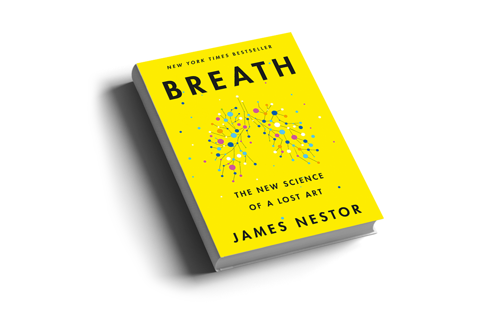

I know that for lots of us living with **Burning Mouth Syndrome (BMS)**, the nights can be the hardest. I used to wake up with a mouth that felt like sandpaper, my burning sensation amplified by hours of mouth breathing and extreme dryness.

Recently, I’ve been experimenting with something that sounded a bit crazy to me at first: **Mouth Taping**.

## Why I Started Mouth Taping

I realized that like many people, I was mouth-breathe in my sleep without even realizing it. This was drying out my oral mucosa, which for my BMS, was like throwing fuel on a fire. I've found that dryness is one of my biggest triggers for "The Burn."

## How weird is it to wear it the first time?

I won't lie, the first time I put tape on my mouth, it felt incredibly unnatural. There's a primal part of your brain that thinks, *"Wait, are you sealing my airway?"* 

For the first few minutes, I was hyper-aware of it. I found myself testing my ability to open my mouth (which you can still do, the tape just provides resistance). But surprisingly, after about 10 minutes of reading or watching TV, the sensation faded into the background.

By the time I actually fell asleep, I didn't even notice it. And waking up without that sandpaper-dry tongue made the initial weirdness 100% worth it. It’s a mental hurdle more than a physical one.

By using a small piece of medical-grade tape to keep my lips together, I now force myself to use **nasal breathing**. I've learned that nasal breathing filters, warms, and humidifies the air, which keeps my mouth moist and makes my symptoms much more manageable.

## My Results

After just three nights of my experiment, I noticed:

**Reduced My Morning Burn**  
The initial "hit" of pain I felt upon waking was significantly lower.

**Less Dryness for Me**  
I didn't have to reach for my water bottle the second I woke up.

**My Sleep Quality Improved**  
I felt more rested, which I attribute to better oxygenation from nasal breathing.

### The Data: Why I Care About Dryness

	

		BMS Prevalence
		BMS patients report subjective dry mouth
		

			

				<svg viewBox="0 0 100 100">
					<circle class="stat-circle-bg" cx="50" cy="50" r="45"></circle>
					<circle class="stat-circle-progress" cx="50" cy="50" r="45" style="--final-offset: 113"></circle>
				</svg>
			

		

		60%+
		<a href="https://pmc.ncbi.nlm.nih.gov/articles/PMC8143492/" class="stat-source" target="_blank">Source: Study (PMC)</a>
	

	

		Clinical Data
		Prevalence in clinical study groups
		

			

				

			

		

		78.7%
		<a href="https://explorationpub.com/Journals/em/Article/100130" class="stat-source" target="_blank">Source: Clinical Group</a>
	

	

		Pain Triggers
		Patients experience escalation during peak dryness
		

			

				

				

			

		

		9/10
		<a href="https://pmc.ncbi.nlm.nih.gov/articles/PMC8143492/" class="stat-source" target="_blank">Source: Clinical Summary</a>
	

I've looked into the research and found a massive overlap between BMS and oral dryness:
- I found that **60% or more** of BMS patients suffer from subjective dry mouth ([Xerostomia](https://pmc.ncbi.nlm.nih.gov/articles/PMC8143492/)).
- In some clinical groups I studied, the prevalence of dryness is reported as high as **78.7%** ([Source](https://explorationpub.com/Journals/em/Article/100130)).
- These studies suggest to me that even when saliva flow is technically "normal," the **sensation** of dryness can amplify our burning perception by up to 2x.

### Mouth Breathing: A Widespread Issue

	

		Adult Statistics
		Adults identifying as habitual mouth breathers
		

			

				

			

		

		61%
		<a href="https://sleepreviewmag.com/sleep-disorders/breathing-disorders/obstructive-sleep-apnea/sixty-one-percent-adults-mouth-breathers/" class="stat-source" target="_blank">Source: Sleep Review Mag</a>
	

	

		Childhood Trends
		Max prevalence in children (3-9 years)
		

			

				<svg viewBox="0 0 100 100">
					<circle class="stat-circle-bg" cx="50" cy="50" r="45"></circle>
					<circle class="stat-circle-progress" cx="50" cy="50" r="45" style="--final-offset: 124"></circle>
				</svg>
			

		

		56%
		<a href="https://pmc.ncbi.nlm.nih.gov/articles/PMC4295456/" class="stat-source" target="_blank">Source: NIH Study</a>
	

I've realized that mouth breathing isn't just a BMS issue, it's a modern epidemic. The statistics I found are eye-opening:
- **61% of adults** identify as mouth breathers ([Sleep Review Mag](https://sleepreviewmag.com/sleep-disorders/breathing-disorders/obstructive-sleep-apnea/sixty-one-percent-adults-mouth-breathers/)).
- In the studies I read, the prevalence in children can range from **11% to 56%** ([National Institutes of Health](https://pmc.ncbi.nlm.nih.gov/articles/PMC4295456/)).

## Where I Learned This

My journey into mouth taping didn't start with BMS, but with understanding human physiology from some of the best in the field:

1. **James Nestor’s book "Breath"**: This was my first introduction to the science of nasal breathing and how I realized chronic mouth breathing was destroying my oral health.
2. **ButeykoPlus.com**: One of my clients, **[ButeykoPlus](https://buteykoplus.com)**, is a leading resource for the Buteyko Breathing Method. Their expertise in breath retraining was pivotal in helping me connect these concepts to managing my own BMS symptoms.

---

## My BMS Bedtime Protocol (Trial This!)

If you're coming here from my [YouTube video](https://www.youtube.com/@decodingtheburn), here is the step-by-step checklist I use every night:

	

		

			<h4 style="margin: 0 0 0.5rem 0; color: var(--text-primary); font-size: 1.5rem; font-weight: 700;">I Hydrate 1 Hour Before</h4>
			
I don't drink right before bed to avoid waking up, but I ensure deep hydration early in the evening.

		

		

			
💧

		

	

	

		

			<h4 style="margin: 0 0 0.5rem 0; color: var(--text-primary); font-size: 1.5rem; font-weight: 700;">I use a Nasal Rinse</h4>
			
I use a saline spray to ensure my "primary airway" is clear.

		

		

			
👃

		

	

	

		

			<h4 style="margin: 0 0 0.5rem 0; color: var(--text-primary); font-size: 1.5rem; font-weight: 700;">My Recommended Tape</h4>
			
I use <a href="https://www.amazon.com/s?k=3M+Micropore+Surgical+Tape" style="color: var(--accent); font-weight: 600;">3M Micropore Surgical Tape</a>. I find it medical-grade, breathable, and gentle on my skin.

		

		

			
🩹

		

	

	

		

			<h4 style="margin: 0 0 0.5rem 0; color: var(--text-primary); font-size: 1.5rem; font-weight: 700;">I Sleep on My Side</h4>
			
I've found this naturally keeps my tongue in a better position to maintain moisture.

		

		

			
🛌

		

	

> [!TIP]
> **My Pro Tip for Easy Removal**: If you find the tape hard to remove in the morning, try what I do: Before applying the tape to your mouth, press it onto the **back of your hand** a few times. This "pre-sticks" it slightly, removing just enough adhesive so it stays on for me all night but peels off comfortably in the morning.

## Questions I Had (and Answers I Found)

**What if I can't breathe through my nose?**
If I have a cold or chronic congestion, **I do not** use mouth tape. My goal is to encourage nasal breathing, not to struggle for air. I use a saline rinse first to clear my passages.

**Was I afraid I might choke?**
Initially, yes. But I learned that our bodies have strong reflexes to wake us up or open our mouths if we truly can't breathe. When I was nervous, I started by wearing the tape for 10 minutes while watching TV to get used to the sensation.

**What tape should I avoid?**
I've learned never to use duct tape, packing tape, or strong athletic tape. These can damage the sensitive skin on our lips. I stick to medical-grade surgical tape like the [3M Micropore](https://www.amazon.com/s?k=3M+Micropore+Surgical+Tape).

---

### Other Content I've Created
- **[How I Manage BMS at Home](/blog/managing-bms-at-home)**: More simple habits I use for relief.
- **[My YouTube Journey](/blog/my-youtube-goal)**: Why I started this project.

**Stay tuned for my full breakdown and video!**

